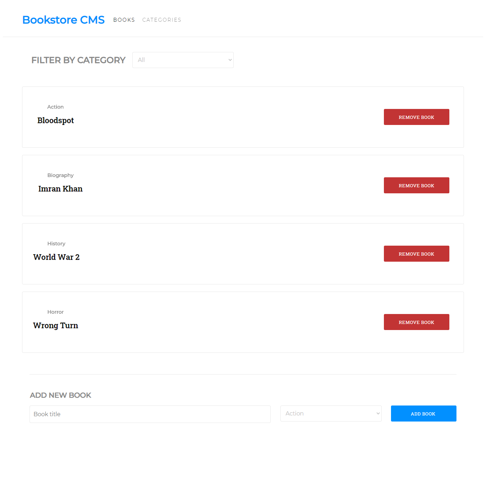

<h1 align="center">
  <br>
    React Bookstore
  <br>
</h1>

<h4 align="center">Implemented the main functionalities of the library management web application. Users can add new books, remove books, and filter books. Built with: React, Redux, Javascript, Webpack, Babel, Eslint, GitHub, Heroku.
</h4>
</br>


</br>

<p align="center">
  <a href="#key-features">Key Features</a> •
  <a href="#how-to-use">How To Use</a> •
  <a href="#credits">Credits</a> •
  <a href="#screen-shot">Screen Shot</a> •
  <a href="#license">License</a> •
  <a href="#authors">Authors</a> •
</p>


## Key Features

* User can add a new book to the library
* User can remove the book from the library
* User can filter boos from library

## How To Use

```bash
# Clone this repository
$ git clone https://github.com/TashfeenRao/react-bookstore

# Go into the repository
$ cd react-bookstore

# Install dependencies
$ npm install

# Run the app
$ npm start
```

## Screen Shot



## Live version

https://react-bookstore-tash-den.herokuapp.com/.

## Emailware

Book-store is an Open-source. if you liked using this app or it has helped you in any way, I'd like you to send me an email at <raotashfeen25@gmail.com> about anything you'd want to say about this software. I'd appreciate it!

## Credits

This software uses the following open-source packages:

- [React](https://React.org/)
- [Redux](https://Redux.org/)
- [Node.js](https://nodejs.org/)
- [Webpack](https://webpack.js.org/)
- [Babel](https://babeljs.io/)
- [Jest](https://jestjs.io/)
- [Microverse](http://microverse.org/)
- [Odin Project](https://www.theodinproject.com/)

## License

MIT

## Authors
---

<h2>Tashfeen Rao and Denis Oluka</h2>

Porfolio [Tashfeen Rao](https://tashfeen-rao.netlify.app/) &nbsp;&middot;&nbsp;
</br>
Email: tashfeendev@gmail.com &nbsp;&middot;&nbsp;
</br>
AngelList [TashfeenRao](https://angel.co/u/tashfeen-rao) &nbsp;&middot;&nbsp;
</br>
LinkedIn [Tashfeen Rao](https://www.linkedin.com/in/tashfeen-rao/) &nbsp;&middot;&nbsp;
</br>
Twitter [@TashfeenDev](https://twitter.com/TashfeenDev) &nbsp;&middot;&nbsp;


Porfolio [Denis Oluka](https://olukadenis.me) &nbsp;&middot;&nbsp;
</br>
Email: olukadeno@gmail.com &nbsp;&middot;&nbsp;
</br>
AngelList [Denis Oluka](https://angel.co/u/denis-oluka) &nbsp;&middot;&nbsp;
</br>
LinkedIn [Denis Oluka](https://www.linkedin.com/in/denis-oluka) &nbsp;&middot;&nbsp;
</br>
Twitter [@dennycodev](https://twitter.com/dennycodev) &nbsp;&middot;&nbsp;
